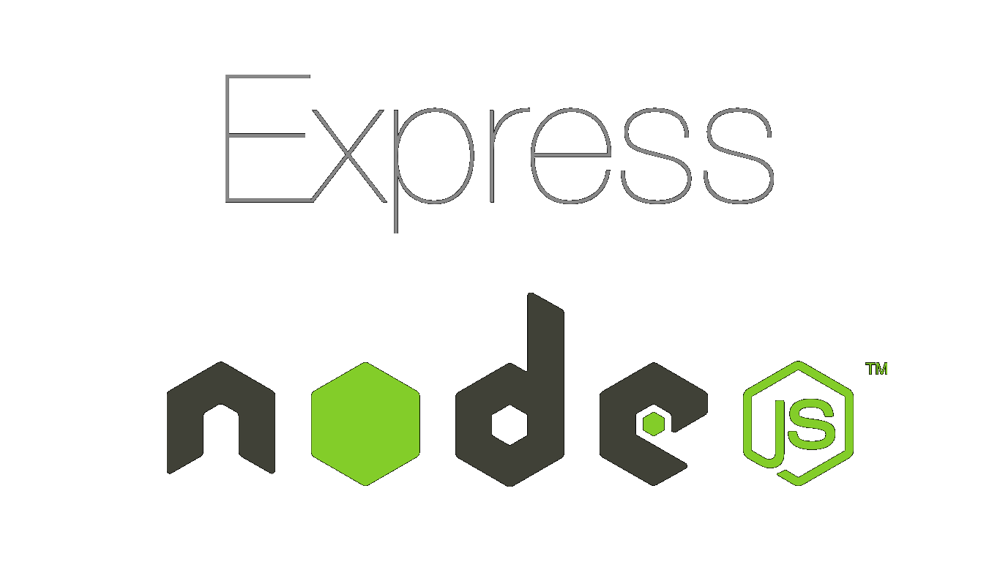
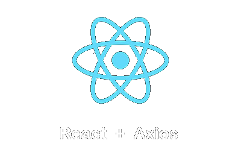

# Description about project and stack 

# This project was created for course work No. 1 for KhPI. 

The project uses MySQL for the database, 
Node.js for the backend logic. 
Express.js for running an API that simplifies working with routes, requests and responses, a framework for node.js. 
React library which is involved in the frontend part. Also the axios library for react, which performs http requests for api

  
  
  

