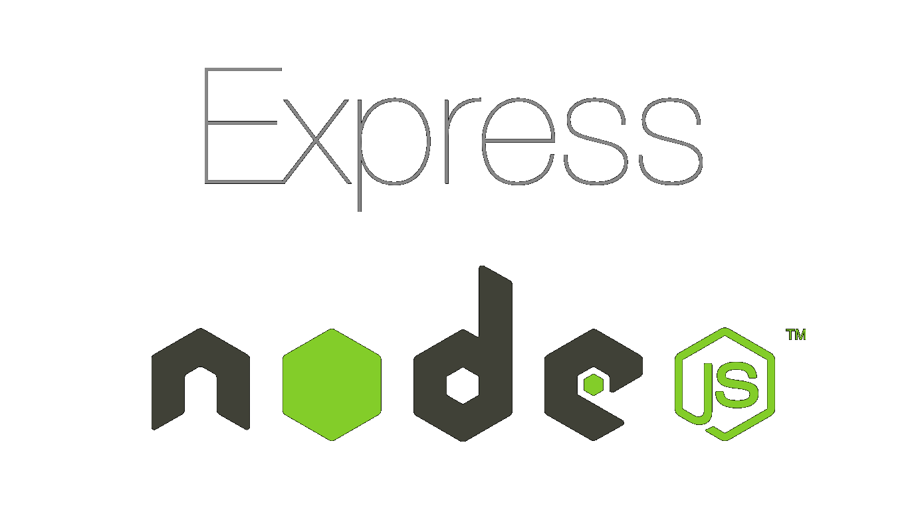
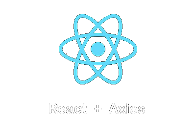

# Description about Project and Stack 

# This project was created for Course Work No. 1 for KhPI. 

<p align="center">
  
  
  
  
  
  
</p>

## Tech Stack

| Technology       | Purpose                                          |
|------------------|--------------------------------------------------|
| **MySQL**        | Database management                              |
| **Node.js**      | Backend logic                                    |
| **Express.js**   | API framework for Node.js                        |
| **React**        | Frontend library                                 |
| **Axios**        | HTTP client for API communication                |
| **JWT**          | Authentication and secure data transmission      |

---

<p align="center">
  
  
  
  
</p>

# Coursework Project Setup

This guide will walk you through the steps to set up and run the project. Follow these instructions to get started with the backend server and the frontend interface.

## Prerequisites

- Make sure you have Node.js and npm or yarn installed on your system.
- If you're on a Unix-based system (like macOS or Linux), you’ll also need `git` and may need `sudo` for certain commands.

## Clone the Repository

First, clone the repository:

```bash
git clone https://github.com/zhbforum/coursework
```

Then, navigate to the project directory:

```bash
cd coursework
```

## Setting up the Backend

### Using `npm`

1. Navigate to the `backend` directory:

   ```bash
   cd backend
   ```

2. Install the required dependencies:

   ```bash
   npm install
   ```

3. Start the server:

   ```bash
   node server.js
   ```

   This will launch the backend server.

### Using `yarn`

1. Navigate to the `backend` directory:

   ```bash
   cd backend
   ```

2. Install the required dependencies:

   ```bash
   yarn install
   ```

3. Start the server:

   ```bash
   yarn start
   ```

   This will launch the backend server.

### For Unix-based Systems

If you are using a Unix-based system (Linux, macOS), you may need to use `sudo`:

- **For npm:**

  ```bash
  sudo node server.js
  ```

- **For yarn:**

  ```bash
  sudo yarn start
  ```

After the server starts, verify that it’s running by checking the console output for confirmation.

---

## Setting up the Frontend

### Using `npm`

1. Navigate to the `frontend` directory:

   ```bash
   cd ../frontend
   ```

2. Install the frontend dependencies:

   ```bash
   npm install
   npm install jwt-decode
   ```

3. Start the UI:

   ```bash
   npm start
   ```

   If prompted to run on a different port (since the server uses port 3000), press `Y` to confirm. React will start the frontend server on an available port and open a browser window with the UI.

### Using `yarn`

1. Navigate to the `frontend` directory:

   ```bash
   cd ../frontend
   ```

2. Install the frontend dependencies:

   ```bash
   yarn install
   yarn add jwt-decode
   ```

3. Start the UI:

   ```bash
   yarn start
   ```

   If prompted to run on a different port (since the server uses port 3000), press `Y` to confirm. React will start the frontend server on an available port and open a browser window with the UI.

### For Unix-based Systems

If you are using a Unix-based system (Linux, macOS), you may need to use `sudo`:

- **For npm:**

  ```bash
  sudo npm start
  ```

- **For yarn:**

  ```bash
  sudo yarn start
  ```

---

## Additional Notes

- **Frontend:** The frontend is developed with React. If you encounter any issues with `npm start` or `yarn start`, try reinstalling dependencies with `npm install` or `yarn install`.
- **Backend:** Ensure the backend is running before starting the frontend to ensure full functionality.

